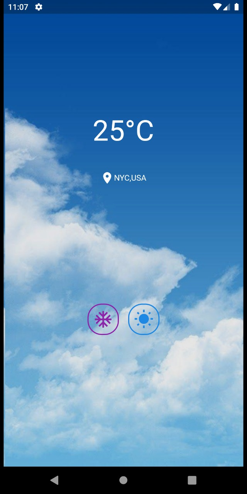

# Flutter Project : Weather App

### What can you contribute to this repo ?
This is an app giving weather information. To contribute, you can add any functionality (e.g. UI updates, Maps API integration etc.) to it and make a pull request. There are no constrains on usage of widgets, external packages and APIs. 

### Initial view of app
(Hard coded values)



### Steps to contribute
1. Click on the fork button on the top right corner of this page.
2. Now go to http://github.com/{your_username}/Flutter  where you can see your own fork of this repo.
3. Open the terminal and clone your fork using 
  ```
  git clone http://github.com/{your_username}/Flutter
  ```
4. Now go inside the directory "Flutter" and checkout to a new branch with name of your choice
  ```
  git checkout -b {branch_name}
  ```
5. Start adding any functionality of your choice.
6. Clean the project for build cache etc
  ```
  flutter clean
  ```
7. Add the files you want to commit to the staging area.
  ```
  git add {folder_name/file_name}
  ```
8. Commit the changes 
  ```
  git commit -m '{Your commit message}'
  ```
9. Push to GitHub.
  ```
  git push origin {branch_name}
  ```
10. Go to http://github.com/{your_username}/Flutter , on the left there is a button to change your branch. Click on it and select {branch_name}.
11. Now you will be able see a button named "Pull request". Click on it.
12. Add appropriate message and click the "Create Pull Request" button.

#### Resolving errors
1. If you get a message like "This branch is X commits ahead, Y commits behind" then visit [this](https://stackoverflow.com/questions/41283955/github-keeps-saying-this-branch-is-x-commits-ahead-y-commits-behind/41289258) thread and follow the steps. Also don't forget to push and pull from proper branches (observe that we have a main branch instead of master).
2. In case of merge conflict visit [this](https://stackoverflow.com/questions/161813/how-to-resolve-merge-conflicts-in-git) thread.
